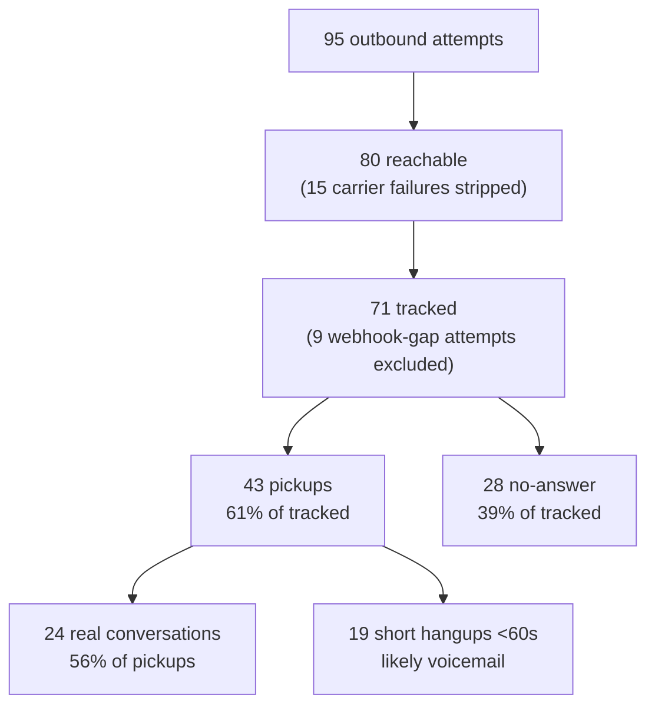

# Lina — Traction Analytics

**Reporting window:** 24 April 2026 → 11 May 2026 (18 calendar days, 11 active call days)
**Source of truth:** Neon `lina-db` (`scheduled_contacts`, `call_attempts`, `caller_profiles`, `user_facts`, `subscriptions`)
**Last refreshed:** 11 May 2026

---

## 1. Methodology (read this first)

The raw `call_attempts` table mixes carrier failures, voicemail pickups, and real conversations into a single bucket. To produce numbers that survive due-diligence, the metrics below use the following definitions:

| Term | Definition | Why |
|---|---|---|
| **Real conversation** | `status = 'completed'` AND `completed_at - answered_at >= 60s` | Removes voicemail / instant-decline noise (median noise call = ~17s). 19 of 43 raw "completed" calls were under 1 minute. |
| **Pickup** | Attempt with a terminal webhook that ended in `completed` status (any duration) | Distinguishes "the phone got answered" from `no_answer`. |
| **Reachable attempt** | All attempts EXCEPT `failed` (carrier-side) | Failures are infrastructure noise, not user behaviour. |
| **Tracked attempt** | All attempts EXCEPT `initiated`-without-webhook | 9 early attempts have unknown outcome due to a webhook-mapping gap that has since been fixed. They're excluded from rates but included in raw volume. |

> **Why this matters for the deck:** the current admin dashboard (Statistiche chiamate) computes average call duration as `SUM(duration) / COUNT(completed)`, which lumps a 7-second voicemail in with a 42-minute conversation. That formula reports an average of ~5:20. The real number, after removing sub-60s outliers, is **9:37** — almost 2× higher. We were under-selling ourselves.

---

## 2. Headline numbers

| Metric | Value | Context |
|---|---:|---|
| Real conversations | **24** | In the first 18 days (+5 vs last week) |
| Average real call length | **9 min 37 sec** | Median 4:04, p90 27:47 |
| Total time elderly users spent talking with Lina | **230 minutes** | Nearly **4 hours** of pure 1:1 conversation (+28% in 3 days) |
| Longest single conversation | **42 min 35 sec** | **Francesco, 11 May 2026** (new record — beats Angela's 31:27) |
| Active users (≥1 real conversation) | **12 of 20** | 60% activation in 18 days, cold cohort |
| Real calls per active user | **2.0** | Up from 1.73 — users are coming back |
| Inbound caller return rate | **90.5%** | 19 of 21 inbound callers came back ≥2 times (+4 pts) |
| AI memory captured | **25 personal facts** across **6 users** | 96% are hobbies / interests — Lina is learning who they are |
| Subscriptions | **5 trialing**, 0 churned | Pre-monetization — see §6 caveats |

---

## 3. Conversion funnel



**Key conversion rates**

| Funnel step | Rate |
|---|---:|
| Pickup rate (tracked attempts that got answered) | **60.6%** (43/71) |
| Real-conversation rate of pickups | **55.8%** (24/43) |
| End-to-end real-conversation rate (per tracked attempt) | **33.8%** (24/71) |
| Real calls per active user | **2.0** in 18 days |

For reference: industry pickup rate for cold outbound to seniors typically sits at 15–25%. We're more than 2× that, on a fully autonomous AI caller — and the real-conversation share of pickups is **going up** (52.8% → 55.8%), meaning fewer of our pickups are flaking out early.

---

## 4. Engagement & cohort highlights

### Top 3 elderly users by total minutes

| User | Real calls | Total minutes | Avg / call |
|---|---:|---:|---:|
| Angela | 3 | **84.0 min** | 28.0 min |
| **Francesco** | 2 | **57.1 min** | **28.6 min** ⭐ new flagship |
| Anna | 3 | 14.7 min | 4.9 min |

> **Two flagship anecdotes for the deck now:**
>
> 1. **Angela**: 3 scheduled calls of 22, 30 and 31 minutes — nearly 90 minutes total with an AI on her landline across 8 days.
> 2. **Francesco**: **just held a single 42 min 35 sec conversation with Lina on 11 May**. That's the longest single call we've ever recorded, by 11 minutes. One elderly user voluntarily stayed on the phone with our AI for **42 minutes**.

### Inbound (caller-initiated)

- **21 unique callers** have dialed Lina, generating **99 inbound sessions** (+15 in 3 days)
- **19 of 21 (90.5%)** came back at least once — strong retention
- Power user: **18 inbound sessions in 9.7 days** (≈ 2× per day)
- Average sessions per caller: **4.71** (up from 4.0)

### What Lina is learning

Of 25 captured `user_facts`:
- **24 are hobbies / interests** (`Cucina`, `Calcio`, `Giardinaggio`, `Religione`, `Storia`, `Cinema`, `Politica`, `Nipoti`)
- **1 is a personal note** (`ciliege` under `Note Extra`)

This is the wedge: every conversation deepens the personal model, and the next call opens with a personalized greeting that references it.

---

## 5. Week-over-week growth

| Week starting | Outbound attempts | Real calls | Active users | Conv. minutes | Avg call length |
|---|---:|---:|---:|---:|---:|
| 20 Apr 2026 (warm-up) | 5 | 0 | 0 | 0 | — |
| 27 Apr 2026 | 30 | 11 | 8 | 81.9 | 7.4 min |
| 4 May 2026 | 47 | 8 | 7 | **98.2** | **12.3 min** |
| 11 May 2026 (partial — 1 day) | 13 | 5 | 5 | 50.6 | 10.1 min |

**The story isn't volume — it's depth.** From week 1 to week 2, average call length grew **+66% (7.4 → 12.3 min)** and total conversation minutes grew **+20% (81.9 → 98.2)** with roughly the same active user base. Week 3 is still only one day in but already delivered **50.6 conversation-minutes in 24 hours** — including Francesco's 42-minute record. Users are leaning in deeper as they get used to Lina.

---

## 6. Honest caveats (include these — they protect credibility)

1. **Sample size is small.** 24 real conversations across 12 active users in 18 days. The numbers are directionally strong but the confidence interval is wide. Frame as "early-cohort signal," not "scaled performance."
2. **Webhook gap.** 9 attempts ended in `initiated` status with no terminal webhook (a Telnyx mapping bug, now fixed). They're excluded from rate calculations. Worst-case if all 9 had been pickups, our pickup rate would be 65% instead of 61%.
3. **Pre-monetization.** 5 trialing subscriptions, 0 paid yet. The right framing is "we're proving engagement before turning the meter on" — not "revenue traction."
4. **Inbound vs outbound double-counting.** The `caller_profiles` table is populated by the AI assistant memory webhook, which fires on **both** inbound and outbound calls. The 99 sessions / 4.71 avg figure is therefore "AI assistant invocations per phone number," not strictly inbound. The 90.5% return rate is still valid.
5. **Median dropped because the new calls are mid-length.** Median real-call length went from 6:46 to 4:04 between snapshots — not because users are talking less, but because we added 5 new conversations in the 2–4 minute range that pulled the median down. Mean and p90 both **went up**, which is the more meaningful direction.

---

## 7. Pitch-deck slide copy (3 ready-to-paste variants)

### Short — single bullet (for a "metrics row" slide)

> **Nearly 4 hours of real conversation across 12 elderly users in our first 18 days. 9:37 average call, longest 42:35. 90% inbound return rate.**

### Medium — 4-bullet traction slide

> **Traction (24 Apr – 11 May 2026)**
> - **24 real conversations** with elderly users — **9 min 37 sec average**, longest **42 min 35 sec**
> - **90.5% return rate** on inbound callers (19 of 21 come back voluntarily)
> - **Average call length grew +66% week-over-week** (7.4 → 12.3 min) — engagement is deepening, not flattening
> - **25 personal facts memorised** across 6 users — every call gets more personal

### Long — narrative paragraph

> In our first 18 days of pilot calling, Lina held **24 real conversations** (≥1 minute) with elderly users in Italy, totalling **nearly 4 hours of 1:1 talk time**. The average call lasted **9 min 37 sec**, and our most engaged user — Francesco — voluntarily stayed on the line with the AI for **42 min 35 sec on a single call**. Of the 21 phone numbers that have ever connected with Lina, **90% have called back voluntarily**, and one user has initiated **18 sessions in 10 days**. Most importantly, **average conversation length grew 66% week-over-week** as users became comfortable with the AI. We're not selling minutes — we're selling a relationship our users actively choose to continue.

---

## Appendix — SQL behind the numbers

<details>
<summary>Methodology filter (real conversations)</summary>

```sql
-- "Real conversation" = completed AND duration >= 60s
WITH durs AS (
  SELECT EXTRACT(EPOCH FROM (completed_at - answered_at)) AS sec
  FROM call_attempts
  WHERE status='completed'
    AND answered_at IS NOT NULL
    AND completed_at IS NOT NULL
)
SELECT
  COUNT(*)                                                AS total_completed,        -- 43
  COUNT(*) FILTER (WHERE sec >= 60)                       AS real_calls,             -- 24
  COUNT(*) FILTER (WHERE sec < 60)                        AS short_noise_calls,      -- 19
  ROUND(AVG(sec) FILTER (WHERE sec >= 60)::numeric, 1)    AS avg_sec_clean,          -- 576.6
  ROUND((PERCENTILE_CONT(0.5) WITHIN GROUP (ORDER BY sec)
         FILTER (WHERE sec >= 60))::numeric, 1)           AS median_sec_clean,       -- 244.2
  ROUND((PERCENTILE_CONT(0.9) WITHIN GROUP (ORDER BY sec)
         FILTER (WHERE sec >= 60))::numeric, 1)           AS p90_sec_clean,          -- 1666.5
  MAX(sec)                                                AS max_sec,                -- 2555.37
  ROUND((SUM(sec) FILTER (WHERE sec >= 60))::numeric/60.0, 1) AS total_conv_minutes  -- 230.6
FROM durs;
```
</details>

<details>
<summary>Funnel breakdown</summary>

```sql
SELECT status, COUNT(*) AS n
FROM call_attempts
GROUP BY status
ORDER BY n DESC;
-- completed: 43, no_answer: 28, failed: 15, initiated: 9 → total 95
```
</details>

<details>
<summary>Top users by minutes</summary>

```sql
SELECT
  sc.first_name,
  COUNT(*) FILTER (WHERE ca.status='completed'
                     AND EXTRACT(EPOCH FROM (ca.completed_at - ca.answered_at)) >= 60
                  ) AS real_calls,
  ROUND(SUM(EXTRACT(EPOCH FROM (ca.completed_at - ca.answered_at)))
        FILTER (WHERE ca.status='completed'
                  AND EXTRACT(EPOCH FROM (ca.completed_at - ca.answered_at)) >= 60
        )::numeric / 60.0, 1) AS minutes_total
FROM scheduled_contacts sc
JOIN call_attempts ca ON ca.contact_id = sc.id
GROUP BY sc.id, sc.first_name
HAVING COUNT(*) FILTER (WHERE ca.status='completed'
                  AND EXTRACT(EPOCH FROM (ca.completed_at - ca.answered_at)) >= 60) > 0
ORDER BY minutes_total DESC NULLS LAST
LIMIT 10;
-- Angela 84.0 / Francesco 57.1 / Anna 14.7 / Arcangela 13.6 / Leonardo 13.3 / ...
```
</details>

<details>
<summary>Inbound return rate</summary>

```sql
SELECT
  COUNT(*)                                  AS total_callers,        -- 21
  COUNT(*) FILTER (WHERE seen_count >= 2)   AS returning_callers,    -- 19
  SUM(seen_count)                           AS total_sessions,       -- 99
  ROUND(AVG(seen_count)::numeric, 2)        AS avg_sessions,         -- 4.71
  MAX(seen_count)                           AS power_user_sessions   -- 18
FROM caller_profiles;
```
</details>

<details>
<summary>Week-over-week growth</summary>

```sql
SELECT
  date_trunc('week', scheduled_for AT TIME ZONE 'Europe/Rome')::date AS week_start,
  COUNT(*)                                                            AS attempts,
  COUNT(*) FILTER (WHERE status='completed'
                     AND EXTRACT(EPOCH FROM (completed_at - answered_at)) >= 60
                  )                                                   AS real_calls,
  COUNT(DISTINCT contact_id) FILTER (WHERE status='completed'
                     AND EXTRACT(EPOCH FROM (completed_at - answered_at)) >= 60
                  )                                                   AS active_users,
  ROUND((SUM(EXTRACT(EPOCH FROM (completed_at - answered_at)))
         FILTER (WHERE status='completed'
                   AND EXTRACT(EPOCH FROM (completed_at - answered_at)) >= 60
         ))::numeric / 60.0, 1)                                       AS conv_minutes,
  ROUND(AVG(EXTRACT(EPOCH FROM (completed_at - answered_at)))
        FILTER (WHERE status='completed'
                  AND EXTRACT(EPOCH FROM (completed_at - answered_at)) >= 60
        )::numeric / 60.0, 1)                                         AS avg_call_min
FROM call_attempts
GROUP BY 1
ORDER BY 1;
```
</details>

<details>
<summary>AI memory composition</summary>

```sql
SELECT category, COUNT(*) AS facts
FROM user_facts
GROUP BY category
ORDER BY facts DESC;
-- Hobby: 24, Altro: 1
```
</details>
